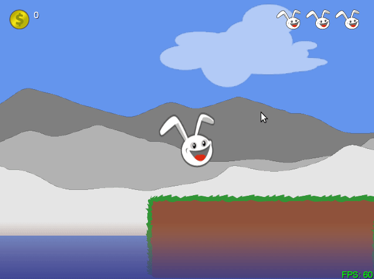

# canyon-bunny
## Sample game to learn Libgdx

Sample Game by Andreas Oehlke Book: Learning Libgdx Game Development.
Published by Packt Publishing Ltd.
[Packtpub](www.packtpub.com)

A 2D platform game built along the book's lessons, to learn how to use the Libgdx library.

_The game is unfinished_. I'm studying the book and i will complete code as my studies progress.

## Demo

[Click here to play: https://bit.ly/34SxrfY](https://bit.ly/34SxrfY)